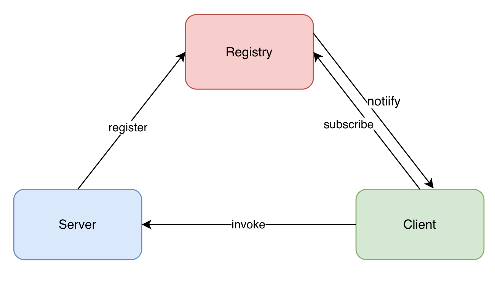
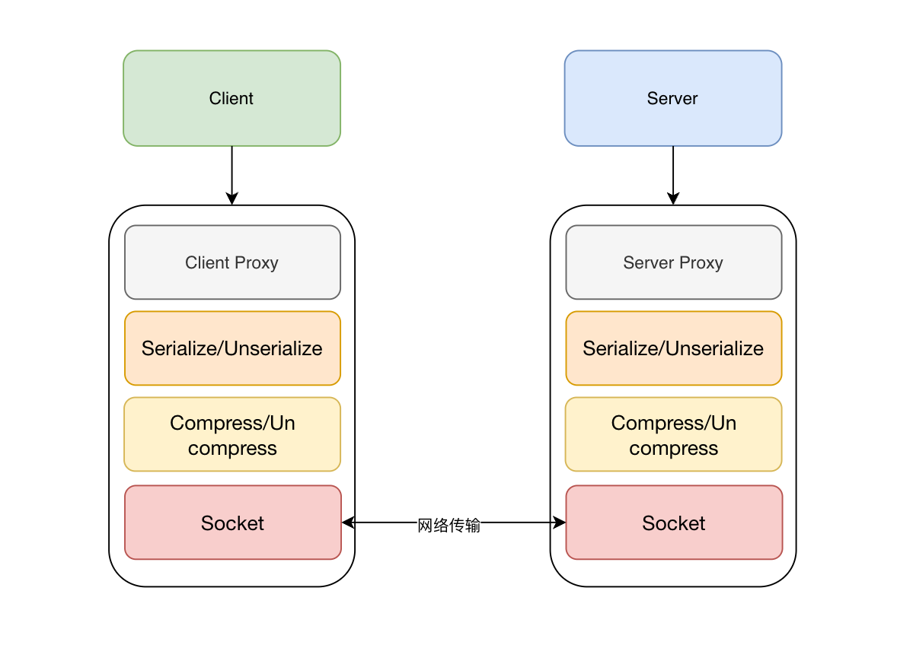

# rpc-spring-starter

## 基本介绍

> rpc-spring-starter是一个基于Netty、Zookeeper、Kryo、Javassist的RPC框架。SpringBoot项目开箱即用，自动发布服务，注入服务。该项目包含不限于RPC原理、Java基础（注解、反射、同步器、Future、SPI、动态代理）、Javassist字节码增强、服务注册与发现、Netty网络通讯、传输协议、序列化、TCP粘包\拆包、长连接复用、心跳检测、SpringBoot自动装载、服务分组、接口版本、Gzip包压缩、客户端连接池、负载均衡、异步调用等。

### 项目依赖

- Zookeeper
- JDK1.8+

### 架构图





### 传输协议

<pre>
    0     1     2     3     4         5     6     7     8     9      10         11         12    13    14    15   16
    +-----+-----+-----+-----+---------+-----+-----+-----+-----+------+----------+----------+-----+-----+-----+-----+
    |   magic   code        | version |      full length      | type | protocol | compress |       RequestId       |
    +-----------------------+---------+-----------------------+------+----------+----------+-----------------------+
    |                                                                                                              |
    |                                             body                                                             |
    |                                                                                                              |
    |                                            ... ...                                                           |
    +--------------------------------------------------------------------------------------------------------------+
  4B  magic code（魔数）      1B version（协议版本）   4B full length（消息长度）    1B type（消息类型）
  1B  compress（压缩类型）     1B protocol（序列化类型）   4B requestId（请求的Id）
  body（object类型数据）
 </pre>

## TODO List

- [x] 基于NIO的Netty网络通讯
- [x] 基于ZK的服务注册发现，服务启动后将服务信息注册到ZK，客户端订阅发布的服务信息。
- [x] 客户端负载均衡，客户端从ZK获取到可用服务列表，客户端可配置负载均衡算法。
- [x] 支持Java、ProtoBuf、Kryo、hessian序列化，Kryo效率最高，java效率最差，默认使用Kryo。
- [x] 增加Netty编解码器，解决TCP粘包\拆包问题。
- [x] 支持可配置的服务端代理模式，可选反射调用、字节码增强。
- [x] 支持异步调用，客户端设置回调方法，调用结束后执行回调。
- [x] 支持Gzip压缩，可在配置文件配置是否启用包压缩，已经压缩算法，减少数据包的大小。
- [x] 支持服务分组与服务版本，服务接口有多个实现类、接口升级版本支持。
- [x] 连接保持心跳，复用长连接，心跳保活。
- [x] 增加传输协议，数据包增加魔数、版本、序列化方式、压缩方式等字段，校验数据包。
- [x] 客户端增加Netty连接池
- [x] 引入Dubbo SPI机制，减少Java SPI机制实例化不使用的类
- [ ] 调用鉴权
- [ ] 调用监控、告警
- [ ] 调用限流、熔断、降级
- [ ] 支持灰度

## 使用方式
> 具体可参考[演示项目](https://github.com/PPPHUANG/rpc-spring-starter-demo)
1. 克隆本项目到本地install。

```bash
mvn clean install -DskipTests=true
```

2. 添加maven依赖到你的`SpringBoot`项目中。

 ```xml
<dependency>
    <groupId>cn.ppphuang</groupId>
    <artifactId>rpc-spring-starter</artifactId>
    <version>0.0.1-SNAPSHOT</version>
</dependency>
 ```

3. 启动ZK。

4. 默认配置项在`RpcConfig`类中，可以通过`application.properties`来覆盖需要修改的配置项。

```properties
#是否启用rpc 默认启用
hp.rpc.enable=true
#注册中心地址
hp.rpc.register-address=127.0.0.1:2128
#服务暴露端口
hp.rpc.server-port=9999
#客户端随机负载均衡 默认：random，可选 random 随机 、round 轮询、 加权轮询 weightRound 、平滑加权轮询 smoothWeightRound
hp.rpc.load-balance=random
#序列化协议 默认：kryo, 可选 kryo 、 java 、 protobuf 、 hessian
hp.rpc.protocol=kryo
#服务是否启用压缩算法 默认：false
hp.rpc.enable-compress=false
#压缩算法 默认：Gzip, 目前可选 Gzip
hp.rpc.compress=Gzip
#Netty客户端是否使用连接池 默认：false
hp.rpc.enable-netty-channel-pool=false
#Netty客户端连接池中的最大连接数
hp.rpc.netty-channel-pool-max-connections=5
#Netty客户端连接池获取连接超时时是否创建新连接 默认：false
hp.rpc.netty-channel-pool-get-new-on-acquire-timeout=false
#服务代理类型 默认：javassist， 可选 reflect 反射调用、 javassist 字节码生成代理类调用
hp.rpc.server-proxy-type=javassist
#服务权重
hp.rpc.weight=1
```

### 服务端

1. 定义服务接口。

```java
public interface HelloService {
    String hello(String name);
}
```

2. 实现服务接口并通过`@RpcService`注解发布服务。

 ```java
import cn.ppphuang.rpcspringstarter.annotation.RpcService;
import cn.ppphuang.rpcspringstarter.annotation.Service;
import cn.ppphuang.rpcspringstarter.service.HelloService;

@RpcService
public class HelloServiceImpl implements HelloService {

    @Override
    public String hello(String name) {
        return name + "hello";
    }
}
 ```

 ```java
import cn.ppphuang.rpcspringstarter.annotation.RpcService;
import cn.ppphuang.rpcspringstarter.service.HelloService;

@RpcService(group = "group1")
public class HelloServiceGroup1Impl implements HelloService {

    @Override
    public String hello(String name) {
        return name + "hello group1";
    }
}
 ```

 ```java
import cn.ppphuang.rpcspringstarter.annotation.RpcService;
import cn.ppphuang.rpcspringstarter.service.HelloService;

@RpcService(group = "group1", version = "version1")
public class HelloServiceGroup1Version1Impl implements HelloService {

    @Override
    public String hello(String name) {
        return name + "hello group1 version1";
    }
}
 ```

当服务实现类实现了多个接口时，需要通过`value`注明该方法提供的是哪个服务接口的实现

 ```java
import cn.ppphuang.rpcspringstarter.annotation.RpcService;
import cn.ppphuang.rpcspringstarter.service.HelloService;

@RpcService(value = "cn.ppphuang.rpcspringstarter.service.HelloService", group = "group2", version = "version2")
public class HelloServiceGroup2Version2Impl implements HelloService, PersionService {

    @Override
    public String hello(String name) {
        return name + "hello group2 version2";
    }
}
 ```

### 客户端

#### 同步调用

1. 使用`@InjectService`注解注入远程服务。

 ```java
import cn.ppphuang.rpcspringstarter.annotation.InjectService;
import cn.ppphuang.rpcspringstarter.service.HelloService;
import org.springframework.stereotype.Service;

@Service
public class TestService1 {
    @InjectService
    HelloService helloService;

    @InjectService(group = "group1")
    HelloService helloServiceGroup1;

    @InjectService(group = "group1", version = "version1")
    HelloService helloServiceGroup1Version1;

    @InjectService(group = "group2", version = "version2")
    HelloService helloServiceGroup2Version2;

    public String sayHai(String name) {
        return helloService.hello(name);
    }

    public String sayHaiGroup1(String name) {
        return helloService.hello(name);
    }

    public String sayHaiGroup1Version1(String name) {
        return helloService.hello(name);
    }

    public String sayHaiGroup2Version2(String name) {
        return helloService.hello(name);
    }
}
 ```

2. 手动获取代理对象。

```java
class RpcSpringStarterApplicationTests {

    @Autowired
    ClientProxyFactory clientProxyFactory;

    @Test
    void testSync() throws InterruptedException {
        HelloService proxy = clientProxyFactory.getProxy(HelloService.class);
        String ppphuang = proxy.hello("ppphuang");
        System.out.println(ppphuang);
    }

    @Test
    void testSyncGroupVersion() throws InterruptedException {
        HelloService proxy = clientProxyFactory.getProxy(HelloService.class, "group1");
        String ppphuang = proxy.hello("ppphuang");
        System.out.println(ppphuang);
    }

    @Test
    void testSyncGroupVersion() throws InterruptedException {
        HelloService proxy = clientProxyFactory.getProxy(HelloService.class, "group1", "version1");
        String ppphuang = proxy.hello("ppphuang");
        System.out.println(ppphuang);
    }
}
```

#### 异步调用

1. 首先继承`AsyncReceiveHandler`实现抽象方法。

```java
public class TestCallBackHandler extends AsyncReceiveHandler {
    @Override
    public void callBack(Object context, Object result) {
        System.out.println(context);
        System.out.println(result);
    }

    @Override
    public void onException(Object context, Object result, Exception e) {
        System.out.println(context);
        System.out.println(result);
    }
}
```

2. 手动获取异步代理对象。

```java
class RpcSpringStarterApplicationTests {

    @Autowired
    ClientProxyFactory clientProxyFactory;

    @Test
    void testAsync() throws InterruptedException {
        //获取异步代理类
        HelloService proxy = clientProxyFactory.getProxy(HelloService.class, "group1", "version1", true);
        //继承AsyncReceiveHandler 实现抽象方法 然后实例化自定义的回调对象
        TestCallBackHandler callBackHandler = new TestCallBackHandler();
        //设置的回调上下文以及回调对象
        ClientProxyFactory.setLocalAsyncContextAndAsyncReceiveHandler("context", callBackHandler);
        //异步回调方法同步返回空
        String ppphuang = proxy.hello("ppphuang");
        System.out.println(ppphuang);
        Thread.sleep(10000);
    }
}
```